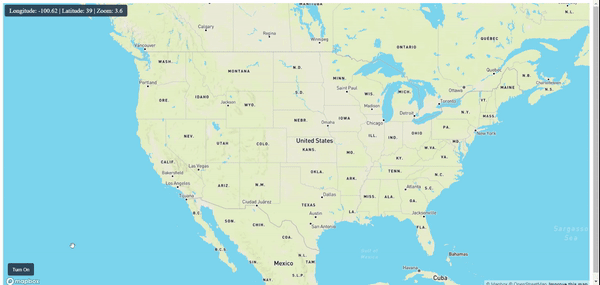

# Fire Incidents for the USA
This ReactJs package helps you to show fire incidents on a Mapbox map. This package fetches data using free APIs of ArcGIS for the USA only. You can turn on and off the fire layer.

## Installation
You can install fire-incidents-usa and its dependencies with npm: `npm install fire-incidents-usa`

## Usage

#### Import
`import FireIncidents from 'fire-incidents-usa';`

#### Turn on Fire Layer
In component use ref to call FireIncidents methods.
```
const fireRef = useRef(null);

<FireIncidents 
    ref={fireRef}
    options= {{
        opacity: 0.8,
        fireImage: FireImage,
        fireImageSize: 0.4
    }}
    getLoader={(isLoader) => setLoader(isLoader)}
/>
```

```
fireRef.current.trunOnFireIncidents(true, map.current);
```

#### Turn off Radar Layer
```
fireRef.current.trunOnFireIncidents(false, map.current);
```

#### Get the Loader while the first layer is still loading
Pass the getLoader prop to the component.
```
getLoader={(isLoader) => {
    // Write your logic here.
}}
```

### Some options that you can pass to the component
```
options= {{
    opacity: 0.8, // Radar Layer opacity min:0, max:1
    fireImage: 'fireimage-path', //Fire Image Path,
    fireImageSize: 0.4 //Size of the Image
}}
```
#### Full example is provided into example directory

